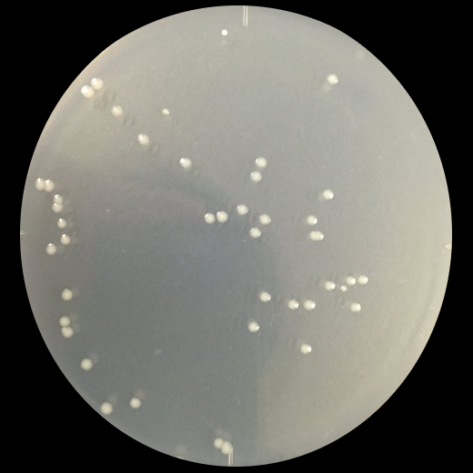
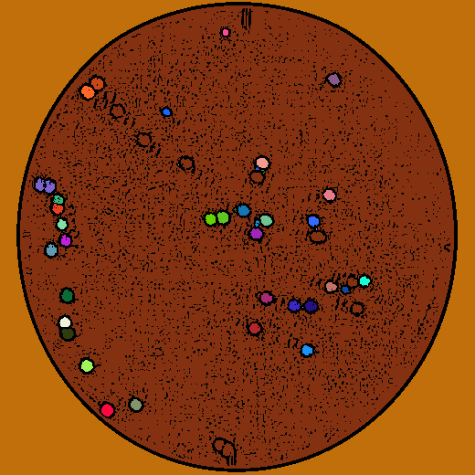
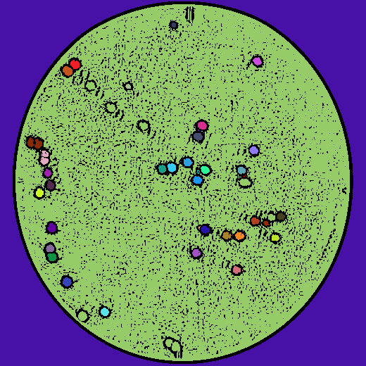
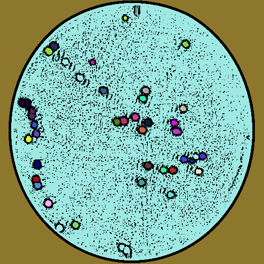
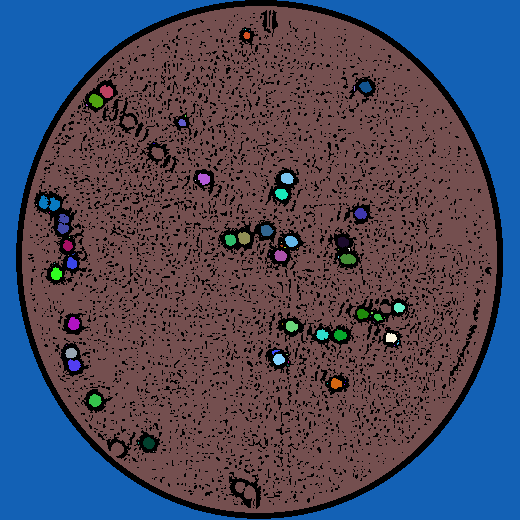
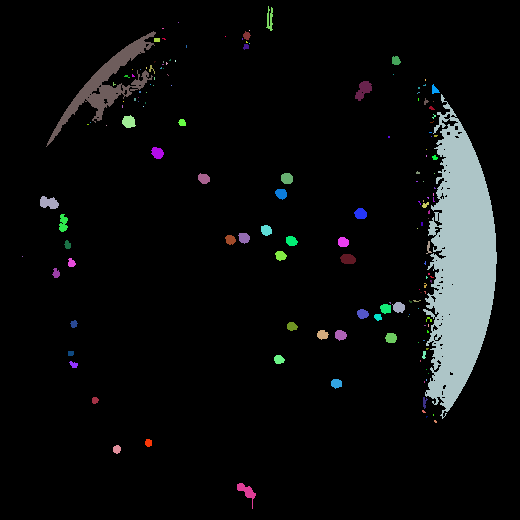
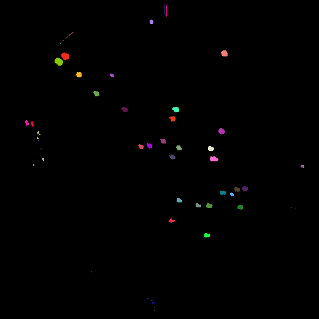
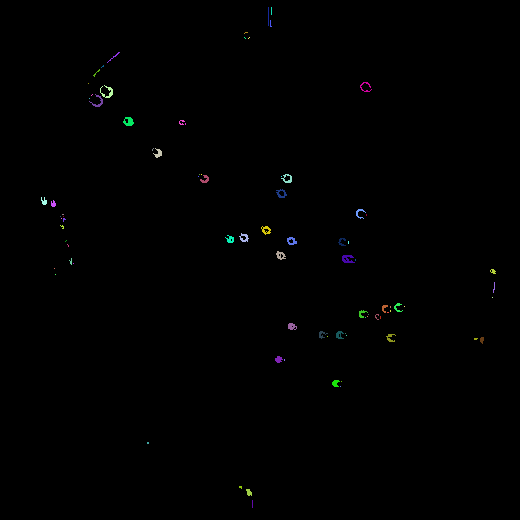
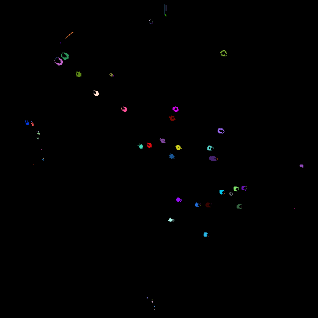

# E.coil's Counter
Last week, I cultured E.coil and counted them. It was very boring and hard time for me to count too small and many colonies. Tha's why I applied Machine Learning and made "E.coil's Counter."



# Method
## Approach 1: threshold
If we use a global value as threshold value, it will be strongly influenced by the shooting environment, so I use <b>different thresholds for different regions of the same image.</b> It gives us better results for images with varying illumination.

### Use `adaptiveThreshold` method in OpenCV.

| params          | role                                                                                 |
|:--------------- |:------------------------------------------------------------------------------------ |
| `Adaptive Method` | `cv.ADAPTIVE_THRESH_MEAN_C` or `cv.ADAPTIVE_THRESH_GAUSSIAN_C`                       |
| `Block Size`      | It decides the size of neighbourhood area. (MUST A ODD NUMBER)                       |
| `C`               | It is just a constant which is subtracted from the mean or weighted mean calculated. |

### Results

| Block Size | Number of Colonies | image |
| ---------- | ------------------ | ----- |
| 7          | 42                 |       |
| 9          | 45                 |       |
| 11         | 57                 |       |
| 13         | 77                 |       |
| 15         | 85                 |       |

There is no meaning about colors.

### How to use?

```sh
$ python Count-by-threshold.py \
--input_path img/E.coil.png \
--output_path img/{}-means-{}-E.coil.png \
--Block_size 9 \
--C 2
```

## Approach 2: K-means
Apply image segmentation by K-means to distinguish the E.coil's region or not.
1. Examine E.coil's color(BGR) in the image (I used [Digital Color Meter](https://support.apple.com/guide/digital-color-meter/welcome/mac)).
2. Apply K-means segmentation to the image.
3. Change the cluster's color closest to the E.colis' to white, and the others' to black.
4. Distinguish E.coils or not.

### Results
| K   | Number of Colonies | image |
| --- | ------------------ | ----- |
| 5   | 155                |       |
| 10  | 52                 |       |
| 15  | 86                 |       |
| 20  | 75                 |       |

## How to use?

```sh
$ python Count-by-K-means.py img/E.coil.png \
--input_path img/E.coil.png \
--output_path img/{}-means-{}-E.coil.png \
--K 15 \
--RGB 222.219.203
```

## Reference
[Image Thresholding — OpenCV-Python Tutorials 1 documentation](https://opencv-python-tutroals.readthedocs.io/en/latest/py_tutorials/py_imgproc/py_thresholding/py_thresholding.html)
