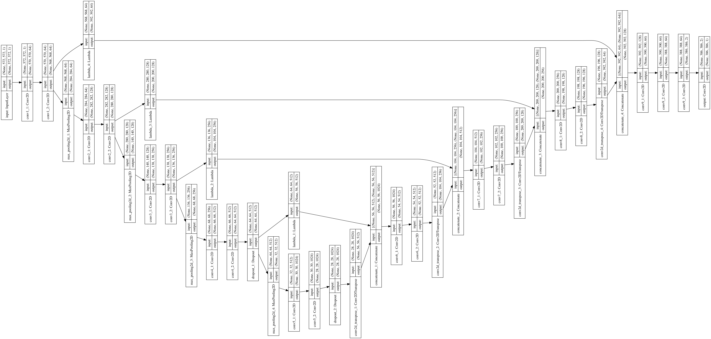

# U-Net
<b>\~Convolutional Networks for Biomedical Image Segmentation\~</b>

## Motivations
Last week, I cultured E.coil and counted them. It was very boring and hard time for me to count too small and many colonies. Tha's why I applied Machine Learning and made "E.coil Counter."

<div align="center"></div>

## Papers
- [U-Net: Convolutional Networks for Biomedical Image Segmentation](https://arxiv.org/abs/1505.04597)
- [Automatic hemolysis identification on aligned dual-lighting images of cultured blood agar plates](https://www.sciencedirect.com/science/article/pii/S0169260717307113)

## The model structure

<summary>keras ver.
  <details></details>
</summary>

| Name                   | image                                          |
| ---------------------- | ---------------------------------------------- |
| 3×3 convolution + ReLU |     |
| 2×2 max-pooling        |     |
| 2×2 up-convolution     |  |

## Overview
U-Net was first designed especially for medical image segmentation. The architecture contains <b>a contracting path (left side)</b> and <b>an expansive path (right side)</b>.
- Left path is just a traditional stack of convolutional and max pooling layers and used to capture the context in the image. (Increase the "What", reduce the "Where".)
- Right path is used to enable precise localization using transposed convolutions. (Create high-resolution segmentation map.)


General FCN (Fully Convolutional Network, above) uses <b>the sum for respective channel</b>, and <b>only a few of feature maps</b>, but U-Net uses <b>"concatenate"</b> and <b>all level's feature maps</b> to keep the localization information.

U-Net uses excessive data augmentation by applying <b>elastic deformations</b> to the available training images. This allows the network to learn invariance to such deformations, <b>without the need to see these transformations in the annotated image corpus.</b>


<b>Overlap-tile strategy</b> for seamless segmentation of arbitrary large images. Prediction of the segmentation in the yellow area, requires image data within the blue area as input. Missing input data is extrapolated by mirroring.

## Results

## Datasets
- [MicrobIA Haemolysis Dataset](http://www.microbia.org/index.php/resources)

## Other methods for E.coil Counter (My hobby)
### 【Approach 1】threshold
If we use a global value as threshold value, it will be strongly influenced by the shooting environment, so I use <b>different thresholds for different regions of the same image.</b> It gives us better results for images with varying illumination.

#### Use `adaptiveThreshold` method in OpenCV.

| params          | role                                                                                 |
|:--------------- |:------------------------------------------------------------------------------------ |
| `Adaptive Method` | `cv.ADAPTIVE_THRESH_MEAN_C` or `cv.ADAPTIVE_THRESH_GAUSSIAN_C`                       |
| `Block Size`      | It decides the size of neighbourhood area. (MUST A ODD NUMBER)                       |
| `C`               | It is just a constant which is subtracted from the mean or weighted mean calculated. |

#### Results

| Block Size | Number of Colonies | image |
| ---------- | ------------------ | ----- |
| 7          | 42                 |       |
| 9          | 45                 |       |
| 11         | 57                 |       |
| 13         | 77                 |       |
| 15         | 85                 |       |

There is no meaning about colors.

#### How to use?

```sh
$ python Count-by-threshold.py \
--input_path img/E.coil.png \
--output_path img/{}-means-{}-E.coil.png \
--Block_size 9 \
--C 2
```

### 【Approach 2】K-means
Apply image segmentation by K-means to distinguish the E.coil's region or not.
1. Examine E.coil's color(BGR) in the image (I used [Digital Color Meter](https://support.apple.com/guide/digital-color-meter/welcome/mac)).
2. Apply K-means segmentation to the image.
3. Change the cluster's color closest to the E.colis' to white, and the others' to black.
4. Distinguish E.coils or not.

#### Results
| K   | Number of Colonies | image |
| --- | ------------------ | ----- |
| 5   | 155                |       |
| 10  | 52                 |       |
| 15  | 86                 |       |
| 20  | 75                 |       |

### How to use?

```sh
$ python Count-by-K-means.py img/E.coil.png \
--input_path img/E.coil.png \
--output_path img/{}-means-{}-E.coil.png \
--K 15 \
--RGB 222.219.203
```

### Reference
[Image Thresholding — OpenCV-Python Tutorials 1 documentation](https://opencv-python-tutroals.readthedocs.io/en/latest/py_tutorials/py_imgproc/py_thresholding/py_thresholding.html)
