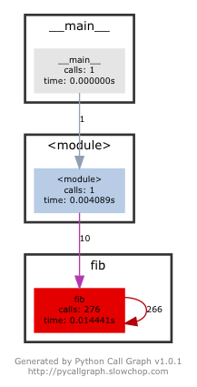

# ML-From-Paper
### \~Build and implement ML models from papers.\~

## Papers
I usually look for state-of-the-art papers from <b>[Papers With Code](https://paperswithcode.com)</b>.

## Datasets
- [arXivTimes](https://github.com/arXivTimes/arXivTimes/blob/master/tools/README.md)
- [機械学習に使えるデータセットまとめ](https://gengo.ai/ja/datasets/the-50-best-free-datasets-for-machine-learning/)
- [Qiita:データ分析に必要なデータソース20選（無料で使える）](https://qiita.com/Hailee/items/bad0c085d293e9253ba2)
- [kaggle](https://www.kaggle.com/datasets)
- [YouTube8-M](https://research.google.com/youtube8m/explore.html)
- [Open Images Dataset V4 + Extensions](https://storage.googleapis.com/openimages/web/download.html)
- [Computer Vision Lab](http://www.vision.ee.ethz.ch/en/datasets/)

## Genre
- Vision
  - Face-Recognition
    - ArcFace
    - FaceNet
  - GradCAM
  - Impainting
  - Pose-Recognition
    - Person-Re-id-2015
- NLP
- Reinforcement Learning
  - Combinatorial-Optimization
- Audio
- Biology
  - U-Net
- Sequence
  - LSTM
  - Seq2Seq
  - Attention
- Simulator Integration
- Others

## Call Graph
It is hard to understand models from program files(.py), so I use `pycallgraph` to visualize function relationships.

ex)
Sample program named `sample.py`
```python
#encoding: utf-8
def fib(n):
    if n<3: return 1
    return fib(n-2) + fib(n-1)

if __name__ == "__main__":
    for i in range(1,11):
        print("fibonacci({}) = {}".format(i,fib(i)))
```

The command-line method of running pycallgraph is:
```sh
pycallgraph graphviz -- ./sample.py
```

Result:

