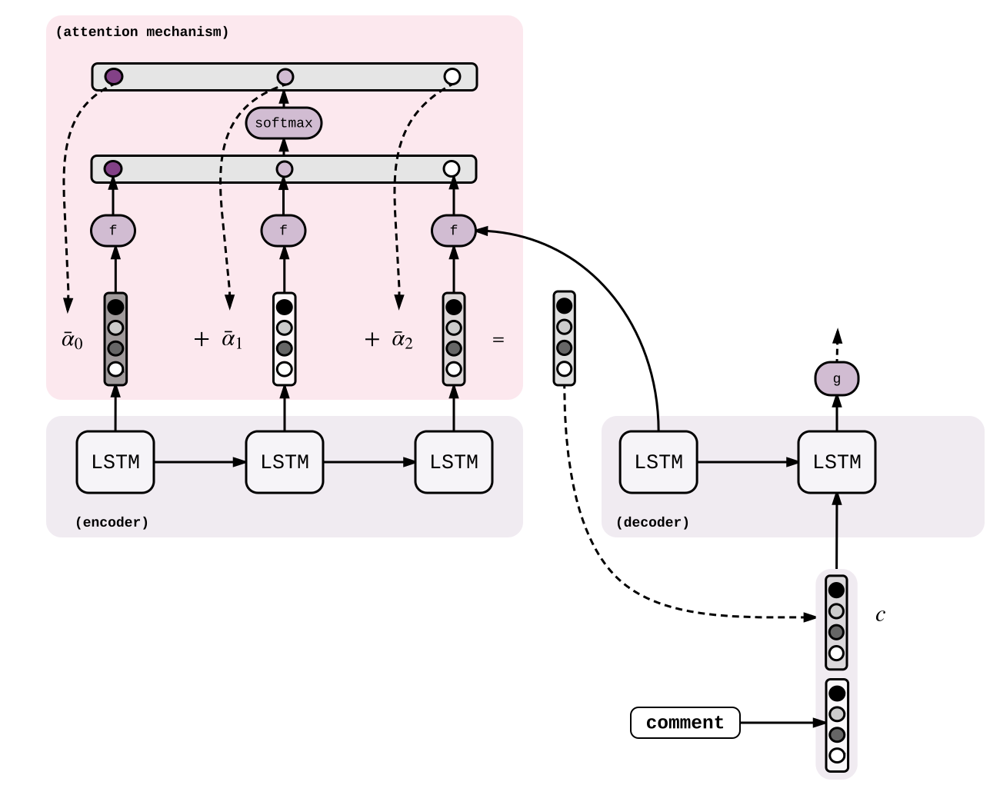

# Attention
## Papers
- [Attention Is All You Need](https://arxiv.org/abs/1706.03762v5)
- [Neural Machine Translation by Jointly Learning to Align and Translate](https://arxiv.org/abs/1409.0473)

## Overview
<b>Attention is a mechanism that forces the model to learn to focus to attend on specific parts of the input sequence when decoding, instead of relying only on the hidden vector of the decoder’s LSTM.</b>
We slightly modify the formula that we defined at [Seq2Seq](https://github.com/iwasakishuto/ML-From-Paper/tree/master/Sequence/Seq2Seq) by adding a new attention (or <b>context</b>) vector ct to the input of the LSTM.

We compute a new context vector at each decoding step. First, with a function f(h_t-1, e_t') compute a score for each hidden state e_t' of the encoder. Then, normalize it and compute ct as the weighted average of the et'

<dic aligne="center">

The choice of the function f varies, but is usually one of the following, <b>each of f represents the degree of association or similarity.</b>

## Reference
- [Seq2Seq with Attention and Beam Search](https://guillaumegenthial.github.io/sequence-to-sequence.html)
