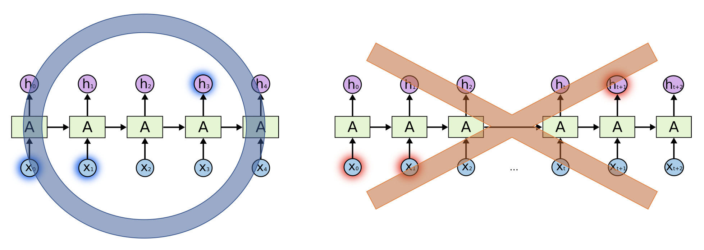
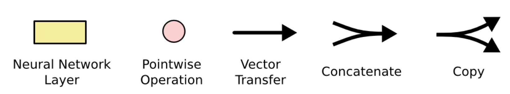

# LSTM
<b>\~Long Short-Term Memory\~</b>
## Papers
- [Long Short-Term Memory](https://dl.acm.org/citation.cfm?id=1246450)

## Motivations
Recurrent Neural Networks can in principle use their feedback connections to store representations of recent input events in form of activations.
However, with conventional "back-Propagation Through Time" or "Real-Time Recurrent Learning", error signals "flowing backwards in time" tend to either
1. blow up:
lead to oscillating weights.
2. vanish:
learning to bridge long time lags takes a prohibitive amount of time, or does not work at all.

Therefore, "Long Short-Term Memory" (LSTM), a novel recurrent network architecture in conjunction with an appropriate gradient-based learning algorithm is presented.

## Network Architecture
### Repeating Module

| standard RNN                                   | LSTM                                               |
| ---------------------------------------------- | -------------------------------------------------- |
| Simple structure, such as a single tanh layer. | There are four, interacting in a very special way. |
|    |                |

### Notation

### Core Idea
The key to LSTM is the cell state, the horizontal line running through the top of the diagram. The information flows along it.

The LSTM does have the ability to remove or add information to cell state by the gates which are composed of sigmoid layers. The sigmoid layer outputs number between 0 and 1, describing how much of each component should be let through.

| Role                              | fig                                |
| --------------------------------- | ---------------------------------- |
| Adjust how much information flows |  |

## Workflow
| #   | Brief Content | fig                              |
| --- | ------------- | -------------------------------- |
| 1   |  Decide <b>what information we're going to throw away</b> from the cell state by using sigmoid layer called <b>"forget gate layer."</b>             |  |
| 2   |  Decide <b>what new information we're going to store</b> in the cell state. This has two parts. First, a sigmoid layer called the <b>"input gate layer" decides which value we'll update.</b> Next, <b>a tanh layer creates a vector of new candidate value</b> (tilde C)             |  |
| 3   |  <b>Update the old cell state</b>, C(t-1) into the new cell state, C(t); Multiply the old state by f(t) <b>to forget the things</b>, then <b>add new candidate values</b> scaled by how much we decided to update each state value.             |  |
| 4   |  Decide <b>what we're going to output</b> based on our cell state. First, we run a sigmoid layer which decides <b>what parts of the cell state we're going to output.</b> Then, we put the cell state through tanh to push the values to be between -1 and 1 and multiply  it by the output of the sigmoid gate, so that we <b>only output the parts we decided to.</b>             |  |

## Variation

|  Paper Title   |  fig   | content    |
| --- | --- | --- |
| [Recurrent nets that time and count](https://ieeexplore.ieee.org/document/861302)    |     |Add "peephole connections" to <b>let the gate layers look at the cell state.</b>      |
|     |     |  Use coupled forget and input gates. Instead of separately deciding what to forget and what we should add new information to, we <b>make those decisions together.</b>   |
|[Learning Phrase Representations using RNN Encoder–Decoder for Statistical Machine Translation](https://aclweb.org/anthology/papers/D/D14/D14-1179/)||Combines the forget and input gates into a single “update gate.” It also merges the cell state and hidden state, and makes some other changes. The resulting model is simpler than standard LSTM models,|

## Reference
- [Understanding LSTM Networks](http://colah.github.io/posts/2015-08-Understanding-LSTMs/)
