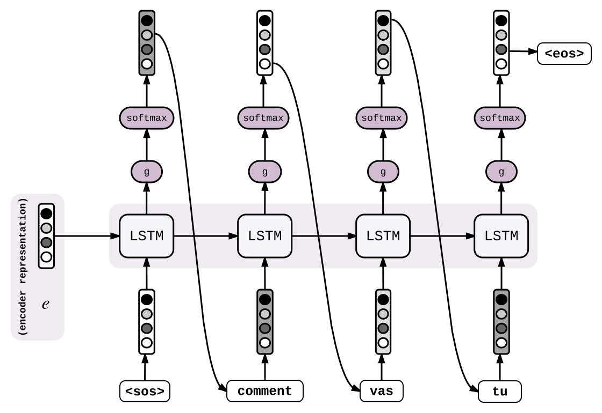

# seq2seq
<b>\~Sequence to Sequence\~</b>
Deep Neural Networks are

## Papers
- [Sequence to Sequence Learning with Neural Networks](https://arxiv.org/abs/1409.3215)

## Overview
A Sequence to Sequence network is a model consisting of two separate RNNs called the <b>encoder</b> and <b>decoder.</b> The encoder encodes the input sequence, and the decoder produces the target sequence.
> As an example, let's translate `how are you` (English) to `Comment vas tu` (French).

### Encoder
Each word from the input sequence is thought <b>as a one-hot vector</b> (That's why we need a vocabulary), so in this case, we have 3 words, thus our input will be transformed into [w0, w1, w2]. Then, we simply run an LSTM and store the last hidden state (e2), this will be our encoder representation e. (e = e2)

### Decoder
Now that we have a <b>vector e that captures the meaning of the input sequence</b>, we'll use it to generate the target sequence word by word. Feed to another LSTM cell: e as hidden state and a special vector w_\<sos\> are inputs. The LSTM computes the next hidden state h0. Then, we apply some function g so that s0 size is equal to the vocabulary. After that, we apply a softmax to s0 to normalize it into avector of probabilities p0. Get a vector w_i0 = w_<comment> and repeat the procedure. <b>The decoding stops when the predicted word is a special vector w_\<eos\></b>

With the seq2seq model, by <b>encoding many inputs into one vector</b>, and <b>decoding from one vector into many outputs</b>, we are freed from the constraints of sequence order and length. The encoded sequence is represented by a single vector, a single point in some N dimensional space of sequences. In an ideal case, <b>this point can be considered the "meaning" of the sequence.</b>

## Training
> In the first step, it seems likely to happen that the model mistranslate at the beginning of the sentence. Then, it would be mess up the entire sequence, and the model will hardly learn anything.

If we use the predicted token as input to the next step during training, <b>errors would accumulate</b> and the model would rarely be exposed to the correct distribution of inputs, making training slow or impossible. To speedup things, one trick is to feed the actual output sequence (`<sos>`, `comment`, `vas`, `tu` ) into the decoder's LSTM and predict the next token at every position (`comment`, `vas`, `tu`, `<eos>`)

## Beam Search
There indeed are 2 main ways of performing decoding at testing time. The first of these methods is <b>greedy decoding.</b> It is the most natural way and it consists in feeding to the next step the most likely word predicted at the previous step. It is very intuitive and easy, but even after training, it can happen that the model makes a small error. This would mess up the entire decoding.

That's why there is another way of performing decoding, called <b>Beam Search.</b> Instead of only predicting the token with the best score, we keep track of "k" hypotheses. At each new time step, for these "k" hypotheses we have V new possible tokens. it makes a total of "kV" new hypotheses. Then, only keep the "k" best ones, and so on. We finally chose the highest score set.

## Reference
- [Seq2Seq with Attention and Beam Search](https://guillaumegenthial.github.io/sequence-to-sequence.html)
