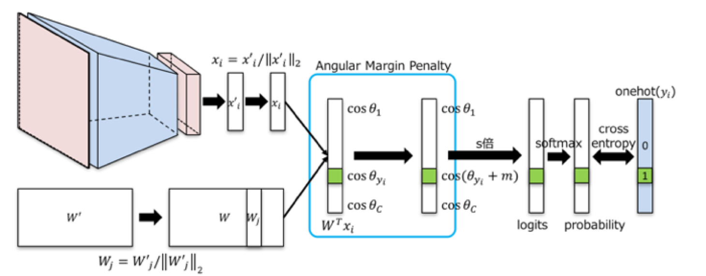
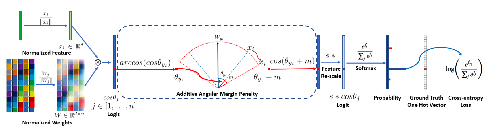
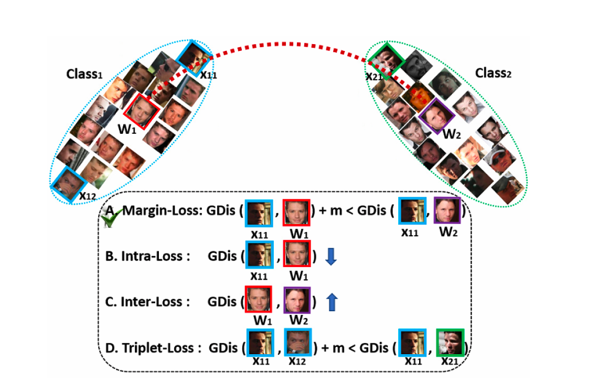

# ArcFace
<b>\~Additive Angular Margin Loss for Deep Face\~</b>

## Papers
- [ArcFace: Additive Angular Margin Loss for Deep Face Recognition](https://arxiv.org/abs/1801.07698)

## The model structure


The dot product between the DCNN(Deep Convolutional Neural Network) feature and the last fully connected layer is <b>equal to the cosine distance after feature and weight normalisation.</b>

## Loss Function


| Name         | Brief Content                                                                   |
| ------------ | ------------------------------------------------------------------------------- |
| Margin-Loss  | insert a geodesic distance margin between the sample and centres.(Like a SVM?)  |
| Intra-Loss   | decrease the geodesic distance between the sample and the corresponding centre. |
| Inter-Loss   | increase the geodesic distance between different centres                        |
| Triplet-Loss | insert a geodesic distance margin between triplet samples                       |

## Algorithm
<b>Input:</b> Feature Scale s, Margin Parameter m, Class Number n, Ground-Truth ID gt.

```python
# The Pseudo-code of ArcFace on MxNet
x = mx.symbol.L2Normalization(x, mode="instance")
W = mx.symbol.L2Normalization(W, mode="instance")
fc7 = mx.sym.FullyConnected(data=x, weight=W, no_bias=True, num_hidden=n)
original_target_logit = mx,sym.pick(fc7, gt, axis=1)
theta = mx.sym.arccos(original_target_logit)
marginal_target_logit = mx.sym.cos(theta + m)
one_hot = mx.sym.one_hot(gt, depth=n, on_value=1.0, off_value=0.0)
fc += mx.sym.broadcast_mul(one_hot, mx.sym.expand_dims(marginal_target_logit - original_target_logit, 1))
fc *= s
```

<b>Output:</b> Class-wise affinity score fc7.

## Overview
- [Centra loss](https://kpzhang93.github.io/papers/eccv2016.pdf) penalises the distance between the deep features and their corresponding class centres in the Euclidean space<b> to achieve intra-class compactness.</b>
- [SphereFace](https://arxiv.org/abs/1704.08063) assumes that the linear transformation matrix in the last fully connected layer can be used as a representation of the class centres in an angular space and penalises the angles between the deep features and their corresponding weights in a multiplicative way.

In this paper, they propose an Additive Angular Margin Loss (ArcFace) to obtain highly discriminative features for face recognition. <b>(maximize face class separability.)</b> The proposed ArcFace has a clear geometric interpretation due to the exact correspondence to the geodesic distance on the hypersphere.

### Sofmax
The most widely used classification loss function, softmax loss is presented as follows:
<div align="center"></div>
where x_i denotes the deep feature of the i-th sample, belonging to the y_i-th class. <b>The softmax loss function does not explicitly optimise the feature embedding to enforce higher similarity for intra-class samples and diversity for inter-class samples</b>, which results in a performance gap for deep face recognition under large intra-class appearance variations (e.g. pose variations and age gaps) and large-scale test scenarios (e.g. million or trillion pairs.)

### Normalization
For simplicity, they fix the bias b_j=0. Then, they transform the logit as  where θ_j is the angle between the weight W_j and the feature x_i. They also normalize the individual weight ||W_j|| = 1 , and embedding feature ||x_i|| by L2 normalization, and re-scale it to s. <b>The normalization step on features and weights makes the predictions only depend on the angle between the feature and the weight.</b> The learned embedding features are thus distributed on a hypersphere with a radius of s.
<div align="center"></div>

### Margin penalty
As the embedding features are distributed around each feature centre on the hypersphere, they add an additive angular margin penalty m between x_i and W_{y_i} to <b>simultaneously enhance the intra-class compactness and inter-class discrepancy.</b>
<div align="center">
