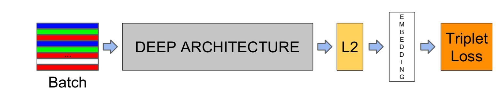
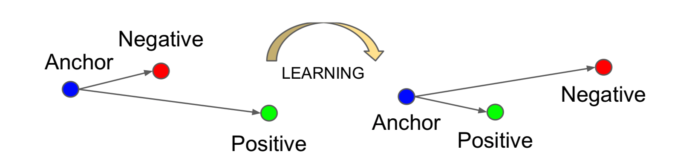

# FaceNet
<b>\~A Unified Embedding for Face Recognition and Clustering\~</b>

## Papers
- [FaceNet: A Unified Embedding for Face Recognition and Clustering](http://arxiv.org/abs/1503.03832)

## The model structure

## Overview
FaceNet directly learns a mapping from face images to a compact Euclidean space where <b>distances directly correspond to a measure of face similality.</b> Therefore, onece this embedding has been produced, then the other kinds of tasks become straight-forward:
- face verification
simply involves thresholding the distance between the two embeddings
- face recognition
equals to k-NN classification problem
- Clustering
can be achieved using off-the-shelf techniques such as k-means or agglomerative clustering (hierarchical clustering);
>Agglomerative Hierarchical Clusteringeach:
 object is initially considered as a single-element cluster (leaf). At each step of the algorithm, the two clusters that are the most similar are combined into a new bigger cluster (nodes). This procedure is iterated until all points are member of just one single big cluster (root)

### Triplet Selection

In order to ensure fast convergence, it is crucial to select triplets that violate the "triplet constraint":

This means that, given an anchor image, we want to select  and . However, it is <b>infeasible to compute the `argmin` and `argmax` across the whole training set.</b> Additionally, it might lead to poor training, as <b>mislabelled</b> and p<b>oorly imaged faces</b> would dominate the hard positives and negatives. There are two obvious choices that avoid this issue:

- Generate triplets <b>offline</b> every n steps, <b>using the most recent network checkpoint</b> and computing the `argmin` and `argmax` on a subset of the data.
- Generate triplets <b>online</b>. This can be done by selecting the hard positive/negative exemplars from <b>within a mini-batch.</b>

#### Generate triplets online
To have a meaningful representation of the anchor-positive distances, it needs to be ensured that a minimal number of exemplars of any one identity is present in each mini-batch. 
