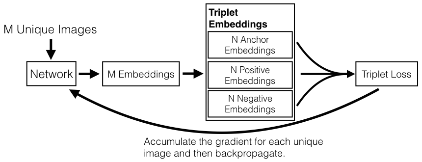
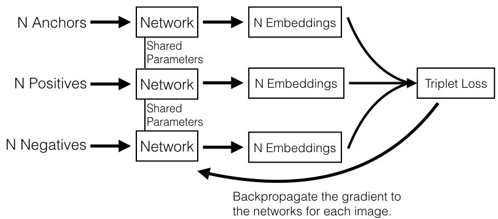

# FaceNet
<b>\~A Unified Embedding for Face Recognition and Clustering\~</b>

## Papers
- [FaceNet: A Unified Embedding for Face Recognition and Clustering](http://arxiv.org/abs/1503.03832)

## Application
I used pretrained model published at [here](https://github.com/davidsandberg/facenet), and [here](https://github.com/nyoki-mtl/keras-facenet).

## The model structure

## Overview
FaceNet <b>directly learns a good embeddings for each face.</b> In the embedding space, <b>distances directly correspond to a measure of face similality.</b> Therefore, onece this embedding has been produced, then the other kinds of tasks become straight-forward:
- face verification
simply involves thresholding the distance between the two embeddings
- face recognition
equals to k-NN classification problem
- Clustering
can be achieved using off-the-shelf techniques such as k-means or agglomerative clustering (hierarchical clustering);
>Agglomerative Hierarchical Clusteringeach:
 object is initially considered as a single-element cluster (leaf). At each step of the algorithm, the two clusters that are the most similar are combined into a new bigger cluster (nodes). This procedure is iterated until all points are member of just one single big cluster (root)

### Triplet Selection

In order to ensure fast convergence, it is crucial to select triplets that violate the "triplet constraint":

This means that, given an anchor image, we want to select  and . However, it is <b>infeasible to compute the `argmin` and `argmax` across the whole training set.</b> Additionally, it might lead to poor training, as <b>mislabelled</b> and p<b>oorly imaged faces</b> would dominate the hard positives and negatives. There are two obvious choices that avoid this issue:

- Generate triplets <b>offline</b> every n steps, <b>using the most recent network checkpoint</b> and computing the `argmin` and `argmax` on a subset of the data.
- Generate triplets <b>online</b>. This can be done by selecting the hard positive/negative exemplars from <b>within a mini-batch.</b>

## Training
### Offline method

Reference: [OpenFace 0.2.0: Higher accuracy and halved execution time](http://bamos.github.io/2016/01/19/openface-0.2.0/)

In offline method, we compute embeddings on the all training set, and then select hard or semi-hard triplets. We can then train one epoch on these triplets.

Concretely, we would produce a list of triplets (i,j,k). We would then create batches of these triplets of size B, which means we will have to compute 3B embeddings to get the B triplets, compute the loss of these B triplets and then backpropagate into the network.

Overall this technique is not very efficient since we need to do a full pass on the training set to generate triplets. It also requires to update the offline mined triplets regularly.

### Online method

Reference: [OpenFace 0.2.0: Higher accuracy and halved execution time](http://bamos.github.io/2016/01/19/openface-0.2.0/)

The idea here is to compute useful triplets on the fly, for each batch of inputs. Given a batch of B examples (for instance B images of faces), we compute the B embeddings and we then can find a maximum of B^3 triplets. Of course, most of these triplets are not valid (i.e. they don’t have 2 positives and 1 negative).

To get <b>a valid triplets</b> more efficiently, it is supposed that you have a batch of faces as input of size B=PK, composed of  P different persons with K  images each. A typical value is K=4. The two strategies are:

- <b>batch all</b>: select all the valid triplets, and average the loss on the hard and semi-hard triplets.
  - a crucial point here is to not take into account the easy triplets (those with loss 0), as averaging on them would make the overall loss very small.
  - this produces a total of PK(K-1)(PK-K) triplets (PK anchors, K-1 possible positives per anchor, PK-K possible negatives)
- <b>batch hard</b>: for each anchor, select the hardest positive (biggest distance d(a,p) and the hardest negative among the batch
  - this produces PK triplets
  - the selected triplets are the hardest among the batch

Reference: [Triplet Loss and Online Triplet Mining in TensorFlow](https://omoindrot.github.io/triplet-loss)
