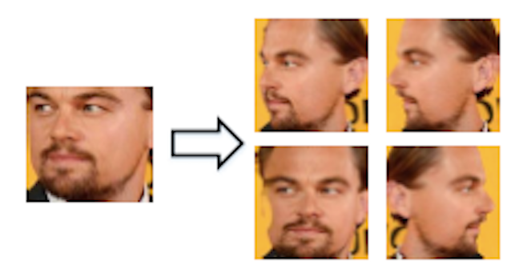
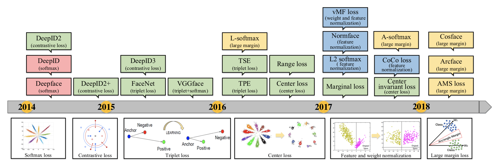
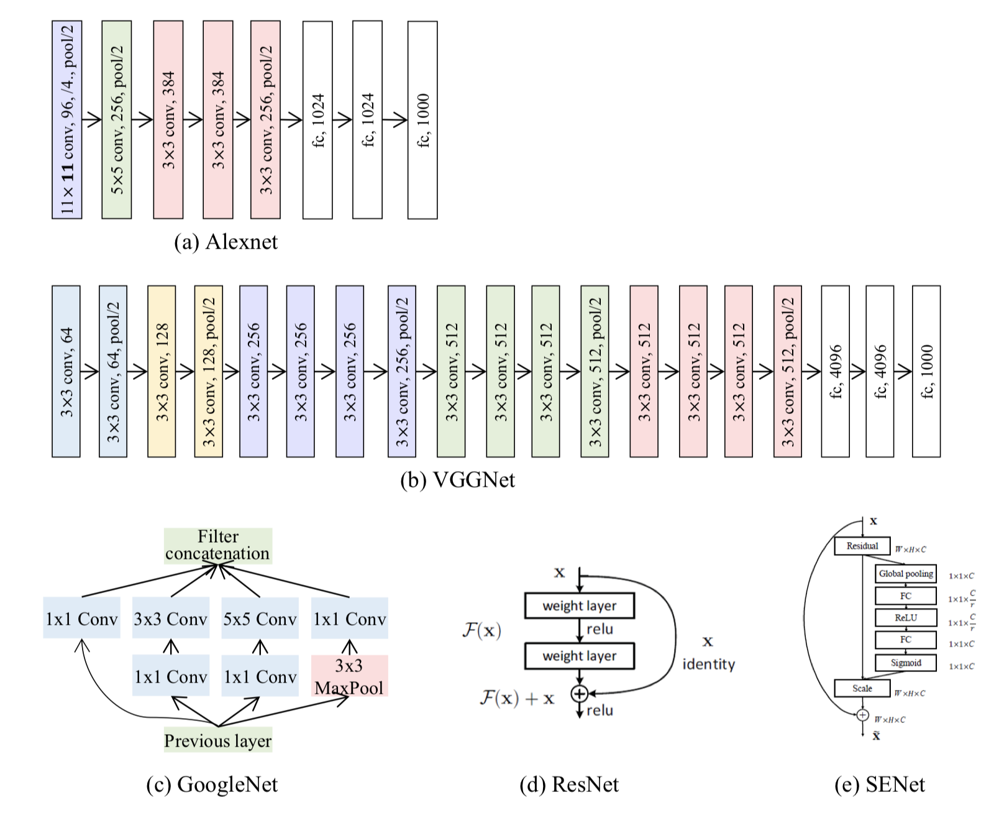

# Face-Recognition (FR)
Reference: [Deep Face Recognition: A Survey](https://arxiv.org/abs/1804.06655)
>Facial recognition:
Making a positive identification of a face in a photo or video image against a pre-existing database of faces. It begins with detection - distinguishing human faces from other objects in the image - and then works on identification of those detected faces.

## Definition
- Face Verification:
Given two face images I1 and I2, we are trying to determine a function f: I1 × I2 → {0,1}, meaning that they are different or same.
- Face identification:
Given a "Gallery(Known)" and "Probe(Unknown)", we are trying to calculate the similarity scores between them.
    - Closed-set identification: "Probe" in "Gallery".
    - Open-set identification: "Probe" not in "Gallery".

## Papers

| Title                                                                                        | Brief Content                                                                                                                                                            |
| -------------------------------------------------------------------------------------------- | ------------------------------------------------------------------------------------------------------------------------------------------------------------------------ |
| [Deep Face Recognition: A Survey](https://arxiv.org/abs/1804.06655)                          | Provides a comprehensive review of the recent developments on deep FR, covering both broad topics on algorithm designs, databases and protocols, and application scenes. |
| [RMDL: Random Multimodel Deep Learning for Classification](https://arxiv.org/abs/1805.01890) |                                                                                                                                                                          |

## Datasets
| Datasets                                                    | Publish Time | #photos         | #subjects        | Features                                         |
| ----------------------------------------------------------- | ------------ | --------------- | ---------------- | ------------------------------------------------ |
| [VGGFace2](http://www.robots.ox.ac.uk/~vgg/data/vgg_face2/) | 2017         | 3.31M           | 9,131            | Depth; cross pose, age, and ethnicity; celebrity |
| [MS-Celeb-1M](https://www.msceleb.org)                      | 2016         | 10M(3.8M clean) | 100K(8.5K clean) | Breadth; celebrity                               |
| [MegaFace](http://megaface.cs.washington.edu)               | 2016         | 4.7M            | 672,057          | Breadth; commonalty                              |
|[LFW](http://vis-www.cs.umass.edu/lfw/)|2007|13K|5K|Used as a Verification datasets|

VGGFace2 and MS-celebrities 1M are collected from Websites and formal occasions; smiling, make-up, young, and beautiful. They are largely different from databases captured in the daily life (Megaface), so <b>it may cause a poor performance in applications when directly adopting the pre-trained models to daily condition.</b>

Considering its application to the real world, it is a very delicate and huge classification task. Therefore, although it is ideal way to keep all face images as a gallery in advance, it is not realistic at all, so <b>we have tried to solve these problems by studying image augmentations, loss functions and network structures, especially in academic field.</b>

## Data Process
| One-to-many                                                                                                                                           | Many-to-One                                                                                     |
| ----------------------------------------------------------------------------------------------------------------------------------------------------- | ----------------------------------------------------------------------------------------------- |
| <b>Generating many patches or images of the pose variability from a single image to enable deep networks to learn pose-invariant representations.</b> | <b>Recovering the canonical view of face images from one or many images of nonfrontal view.</b> |
|                                                                                                                      |                                                                |

## Loss Function

### Euclidean-distance-based
<b>Embeds images into Euclidean space and compresses intra-variance and enlarges inter-variance. The contrastive loss and the triplet loss are the commonly used loss functions.</b>
#### Contrastive Loss
Proposed at ["Dimensionality Reduction by Learning an Invariant Mapping"](https://ieeexplore.ieee.org/document/1640964).

Contrastive loss requires face image pairs and then pulls together positive pairs and pushes apart negative pairs. During training, an image pair is fed into the model with their ground truth relationship Y: Y equals 1 if the two images are similar and 0 otherwise. The loss function is given as follows:

where <b>Dw</b> is defined as the euclidean distance between the outputs of the sister siamese networks. Mathematically the euclidean distance is:

where <b>Gw</b> is the output of one of the sister networks. X1 and X2 is the input data pair.

#### Triplet Loss
Proposed at ["Deep Metric Learning with Hierarchical Triplet Loss"](https://arxiv.org/abs/1810.06951).

An anchor input x_a is compared to a positive input x_p and a negative input x_n. The distance from the anchor input to the positive input is minimized, and the distance from the anchor input to the negative input is maximized. α means margin.

### Angular/Cosine-margin-based
Proposed at ["CosFace: Large Margin Cosine Loss for Deep Face Recognition"](https://arxiv.org/abs/1801.09414).

<b>Angular/Cosine-margin-based loss is proposed to make learned features potentially separable with a large angular/cosine distance.</b>
#### ArcFace

- Fix the bias b_j = 0
- Transform the logit as W_j^Tx_i = ||W_j|| ||x_i|| cosθ_j, where θ_j is the angle between the weight W_j and the feature x_i.
- Fix the individual weights ||W_j|| = 1 by L2 norm.
- Fix the embedding feature ||x_i|| by L2 norm, and re-scale it to s.

As the embedding features are distributed around each feature centre on the hypersphere, we add an additive angular margin penalty m between x_i and W_{y_i} to simultaneously enhance the intra-class compactness and inter-class discrepancy. The loss function is given as follows:

The normalisation step on features and weights makes the predictions only depend on the angle between the feature and weight.

### Softmax loss and its variations
#### Softmax Loss

Normal Softmax Cross Entropy is above. Cross Entropy Loss depends only on the predicted probability for the correct class, so i-th sample's loss is defined as follows:

y_i means i-th sample's correct class. Therefore, the loss function is given as follows:

#### Variations
- Normalization of feature or weight in softmax loss, which can be written as follow:

This can be useful for avoiding predicting as a uniform distribution.(try to reduce the norm of x)
- Noisy softmax to mitigate early saturation by injecting annealed noise in softmax.

## Network Architecture
Mainstream architectures are as follows;

