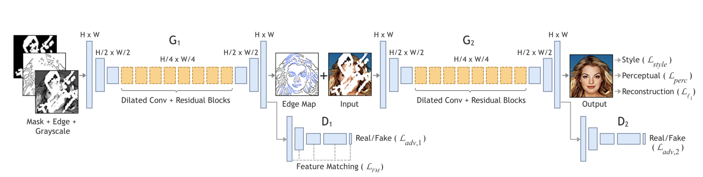

# Inpainting
#### \~Generative Image Inpainting with Adversarial Edge Learning\~
## Papers
- [EdgeConnect: Generative Image Inpainting with Adversarial Edge Learning](https://arxiv.org/abs/1901.00212)

## The model structure

## Overview
These days, deep learning techniques have yielded signigiacant improvements in image inpainting. However, many of these are commonly <b>over-smoothed and/or blurry.</b> This paper proposed a new approach combining two models.
1. Edge generation
is solely focused on hallucinating edges in the missing regions.
2. Image completion
uses the hallucinated edges and estimates RGB pixel intensities of the missing regions.

These approach of "lines first, color next" is partly inspired by understanding of how artists work.
> In line drawing, the lines not only delineate and define spaces and shapes, they also play a vital role in the composition, says Betty Edwards.
