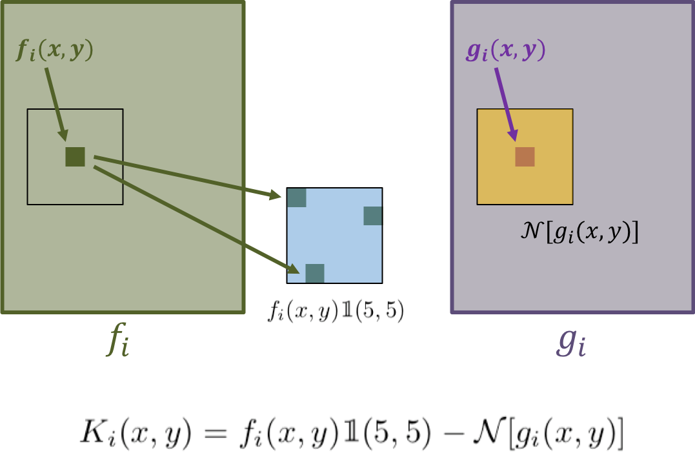
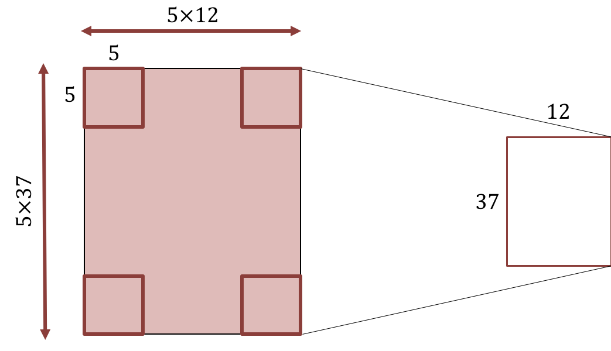
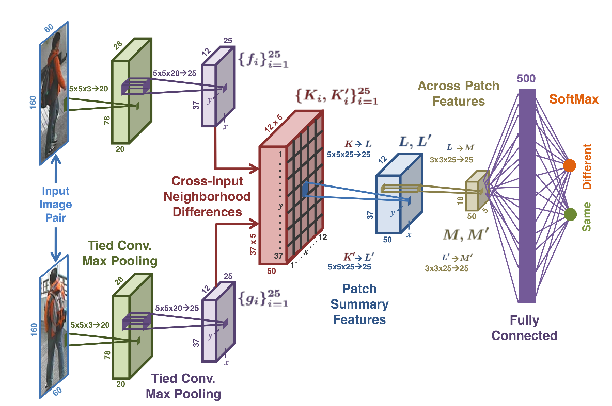
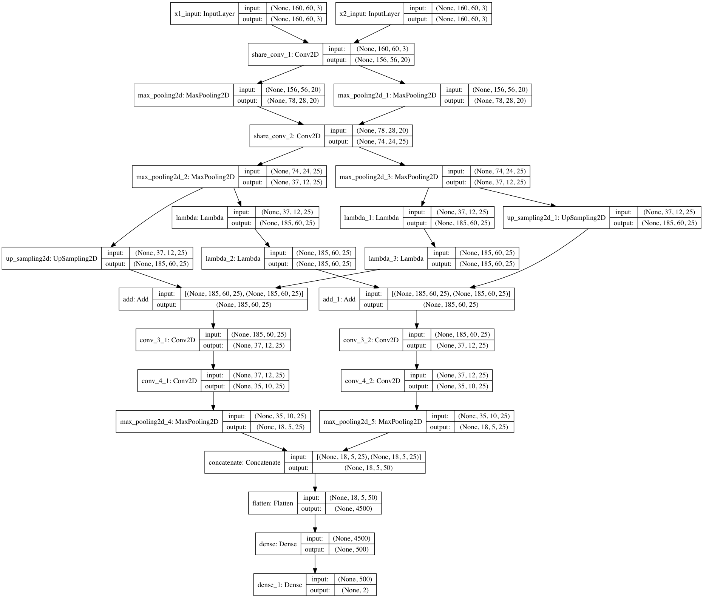

# Person-Re-id-2015
#### \~Implementation CVPR2015-CNN for Re-identification task\~
>Re-Identification:
Identifying people across images that have been taken using different camera, or across time using a single camera.
## Papers
- [An improved deep learning architecture for person re-identification](https://ieeexplore.ieee.org/abstract/document/7299016)

## Overview
Given a pair of images as input, this network model outputs a similarity value indicating whether the two input images depict the same person.

1. Tied Convolution
  - In the deep learning literature, convolutional features have proven to provide representations that are useful for a variety of classification tasks.
  - First two layers perform tied convolution, in which weights are shared across the two views.
2. Cross-Input Neighborhood Differences
  - Computes differences in feature values across the two views around a <b>neighborhood</b> of each feature location.
  - The motivation behind taking differences in a neighborhood is to add robustness to positional differences in corresponding features of the two input images.
  - Pass these neighborhood difference maps through a rectified linear unit(ReLu).
  

3. Patch Summary Features
  - Summarizes these neighborhood difference maps by producing a holistic representation of the differences in each 5 × 5 block.
  - This is accomplished by convolving K with 25 filters of size 5 × 5 × 25, with a stride of 5.
  

4. Across-Patch Features
  - Learn spatial relationships across neighborhood differences.
  - This is done by convolving L with 25 filters of size 3 × 3 × 25 with stride of 1.
  - Pass max pooling kernel to reduce the height and width by a factor of 2.
5. Higher-Order Relationships
  - Apply fully connected layer.
  - Capture higher-order relationships by
    - Combining information from patches that are far from each other.
    - Combining information from M with information from M'.

## The model structure

